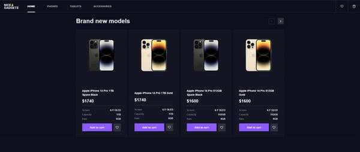
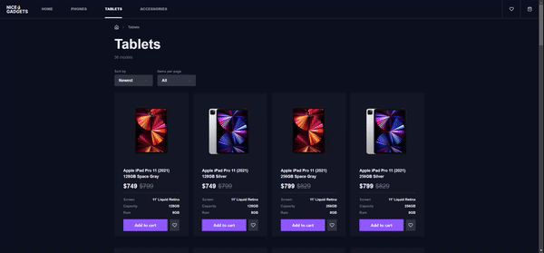

# Nice Gadgets

> A brief description of the project:
  - This is implementation FrontEnd part of online store with the ability to add a product to the shopping cart, as well as the ability to mark a product as liked. 

  - Also you can view images of the products, along with information about the product specifications, features, and prices.
  - Then you can choose type of gadgets, color and memory size.

  

> How to clone this repo:
  - Open yours code editor.
  - Select the directory where you want to clone the project.
  - Use this commands in terminal:
    - `git clone https://github.com/Vitalii-Belostotskiy/react_gadgets-catalog`
    - You need to have node version 14.21.3
    - `npm i` 
    - You need install next dependencies:
       - `npm i react-router-dom`
       - `npm i react-pagination-bar`
       - `npm i swiper`

> How to launch:
  - There is no need for any manipulations, open the terminal in yours code editor and use the next command `npm start`.
  - Enjoy!

> Technologies that were used:
  1) HTML
  2) CSS
  3) SCSS
  4) React
  5) TypeScript

 # Features
  - Markup and styling: Was implemented by HTML/CSS/SCSS.
  - Swiping images: Was implemented by `swiper/react` 
  - Catalogue navigation: Was implemented by `react router dom`.
  - Products pagination: Was implemented by `react pagination bar`
  - Catalogue management: Was implemented by `React Context`.

  [DEMO LINK](https://Vitalii-Belostotskiy.github.io/react_gadgets-catalog/)

  [CODE LINK](https://github.com/Vitalii-Belostotskiy/react_gadgets-catalog)

  [MOCKUP LINK](https://www.figma.com/design/BUusqCIMAWALqfBahnyIiH/Phone-catalog-(V2)-Original-Dark?node-id=0-1&node-type=canvas&t=QFkH7vJakyRuF2l2-0)
